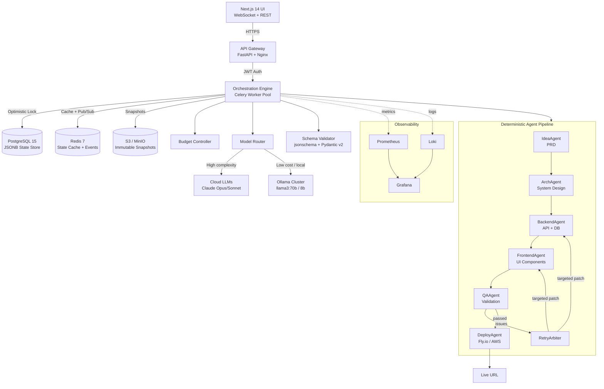

# Production-Ready Agentic Orchestrator Specification

---

## 1. System Architecture



---

## 2. Component-Level Breakdown

### 2.1 API Gateway
- FastAPI application, Nginx reverse proxy upstream
- Handles: auth (JWT RS256), rate limiting (Redis token bucket per user), request validation
- WebSocket endpoint `/ws/projects/{id}` streams real-time stage events
- No business logic — thin routing layer only
- Rate limit: 10 project starts/hour/user, 100 API reads/min/user

### 2.2 Orchestration Engine
- Long-running Celery task per project, not a request handler
- Responsible for: state loading, lock acquisition, stage dispatch, patch merging, snapshot triggering, lock release
- Uses Redis distributed lock (`SET NX EX`) — prevents split-brain on multi-worker deployments
- Task queue: Redis as Celery broker + result backend
- Concurrency: `celery -c 8` (Phase 1), Kubernetes HPA (Phase 3)

### 2.3 State Machine
- Explicit named stages with allowed transitions enforced at the merge layer
- Transitions write to `state.status.stage` and increment `state.meta.version`

### 2.4 Schema Validator
- Validates every agent patch before merge using `jsonschema.validate()` + Pydantic v2
- Per-stage schemas define allowed keys and types
- Semantic validators run after structural validation

### 2.5 Budget Controller
- Singleton per project execution
- Pre-authorizes every LLM call, blocks if budget gates triggered
- Records actual usage post-call

### 2.6 Model Router
- Classifies task complexity by stage
- Checks local node health via Ollama `/api/tags` + GPU utilization polling
- Falls back to cloud on local unavailability

### 2.7 Snapshot Manager
- Content-addressed S3 keys: `snapshots/{project_id}/v{version}-{sha256[:12]}.json`
- Triggered after every successful stage completion
- Rollback restores full state, nullifies downstream stage data

### 2.8 Agents
- Stateless classes, receive full `ProjectState`, return `AgentResponse`
- Registered in a plugin registry
- Each agent owns exclusive keys in the state document

---

## 3. Global State JSON Schema

```json
{
  "$schema": "http://json-schema.org/draft-07/schema#",
  "title": "ProjectState",
  "version": "2.1.0",
  "type": "object",
  "required": ["meta", "status", "inputs", "budget"],
  "properties": {
    "meta": {
      "type": "object",
      "properties": {
        "id":               { "type": "string", "pattern": "^proj_[a-z0-9]{8}$" },
        "version":          { "type": "integer", "minimum": 1 },
        "schema_version":   { "type": "string" },
        "created_at":       { "type": "string", "format": "date-time" },
        "updated_at":       { "type": "string", "format": "date-time" },
        "owner_id":         { "type": "string" },
        "project_name":     { "type": "string" },
        "snapshot_key":     { "type": ["string", "null"] },
        "rollback_history": { "type": "array", "items": { "type": "string" } }
      }
    },
    "status": {
      "type": "object",
      "properties": {
        "stage": {
          "type": "string",
          "enum": ["IDLE","SPECIFYING","ARCHITECTING","BACKEND_GEN",
                   "FRONTEND_GEN","QA_VALIDATION","DEPLOYING",
                   "COMPLETE","FAILED","PAUSED","PENDING_REVIEW"]
        },
        "stage_status":       { "type": "string", "enum": ["pending","running","success","failed","skipped"] },
        "iteration":          { "type": "integer" },
        "max_iterations":     { "type": "integer", "default": 3 },
        "awaiting_approval":  { "type": "boolean" },
        "error":              { "type": ["string", "null"] },
        "completed_stages":   { "type": "array", "items": { "type": "string" } },
        "celery_task_id":     { "type": ["string", "null"] }
      }
    },
    "inputs": {
      "type": "object",
      "required": ["raw_idea"],
      "properties": {
        "raw_idea":          { "type": "string", "minLength": 20 },
        "constraints":       { "type": "array", "items": { "type": "string" } },
        "tech_preferences":  { "type": "object" },
        "target_users":      { "type": "string" },
        "approval_required_stages": { "type": "array", "items": { "type": "string" } }
      }
    },
    "spec":         { "type": ["object", "null"] },
    "architecture": { "type": ["object", "null"] },
    "backend":      { "type": ["object", "null"] },
    "frontend":     { "type": ["object", "null"] },
    "qa":           { "type": ["object", "null"] },
    "infra":        { "type": ["object", "null"] },
    "budget": {
      "type": "object",
      "properties": {
        "limit_usd":           { "type": "number" },
        "spent_usd":           { "type": "number" },
        "token_counts":        { "type": "object" },
        "stage_costs":         { "type": "object" },
        "iteration_counts":    { "type": "object" },
        "frozen":              { "type": "boolean" },
        "downgrade_triggered": { "type": "boolean" },
        "hard_stop_triggered": { "type": "boolean" }
      }
    },
    "logs":    { "type": "array", "maxItems": 500 },
    "history": { "type": "array" }
  }
}
```

### Concrete State Example

```json
{
  "meta": {
    "id": "proj_a1b2c3d4",
    "version": 7,
    "schema_version": "2.1.0",
    "created_at": "2026-02-20T09:00:00Z",
    "updated_at": "2026-02-20T09:47:12Z",
    "owner_id": "user_88f2",
    "project_name": "TaskFlow API",
    "snapshot_key": "snapshots/proj_a1b2c3d4/v7-3f8a92b1c4d2.json",
    "rollback_history": [
      "snapshots/proj_a1b2c3d4/v1-aa00bb11cc22.json",
      "snapshots/proj_a1b2c3d4/v7-3f8a92b1c4d2.json"
    ]
  },
  "status": {
    "stage": "QA_VALIDATION",
    "stage_status": "running",
    "iteration": 1,
    "max_iterations": 3,
    "awaiting_approval": false,
    "error": null,
    "completed_stages": ["SPECIFYING","ARCHITECTING","BACKEND_GEN","FRONTEND_GEN"],
    "celery_task_id": "4f3a2b1c-8e9d-4f01-b234-56789abcdef0"
  },
  "inputs": {
    "raw_idea": "Build a task management API with user authentication, team workspaces, and real-time notifications",
    "constraints": ["PostgreSQL required", "API-first design"],
    "tech_preferences": { "backend": "fastapi", "frontend": "nextjs" },
    "approval_required_stages": ["DEPLOYING"]
  },
  "budget": {
    "limit_usd": 8.00,
    "spent_usd": 1.847,
    "token_counts": { "input_tokens": 48200, "output_tokens": 38100 },
    "stage_costs": {
      "SPECIFYING": 0.18, "ARCHITECTING": 0.44,
      "BACKEND_GEN": 0.82, "FRONTEND_GEN": 0.41
    },
    "frozen": false,
    "downgrade_triggered": false,
    "hard_stop_triggered": false
  },
  "qa": {
    "passed": false,
    "iteration": 1,
    "issues": [
      {
        "id": "issue_001",
        "severity": "critical",
        "agent_target": "backend",
        "description": "POST /tasks missing workspace membership check — IDOR vulnerability",
        "file_path": "backend/app/routes/tasks.py",
        "suggested_fix": "Add workspace_member_required dependency to route handler",
        "resolved": false
      }
    ],
    "test_results": {
      "unit_passed": 24, "unit_failed": 3,
      "integration_passed": 8, "integration_failed": 2,
      "coverage_pct": 61.4
    }
  }
}
```

---

## 4. Agent Interface Contract

```python
from pydantic import BaseModel
from typing import Literal, Any

class CostEstimate(BaseModel):
    input_tokens:  int
    output_tokens: int
    model:         str
    cost_usd:      float

class AgentResponse(BaseModel):
    status:        Literal["ok","needs_info","blocked","error"]
    patch:         dict[str, Any]
    cost_estimate: CostEstimate
    warnings:      list[str] = []
    logs:          list[dict] = []

STAGE_OWNERSHIP: dict[str, list[str]] = {
    "SPECIFYING":    ["spec"],
    "ARCHITECTING":  ["architecture"],
    "BACKEND_GEN":   ["backend"],
    "FRONTEND_GEN":  ["frontend"],
    "QA_VALIDATION": ["qa"],
    "DEPLOYING":     ["infra"],
}

class BaseAgent(ABC):
    OWNED_KEYS: list[str] = []

    async def _call_llm(self, system, user, schema, complexity="medium"):
        model_client = await self.router.select(complexity)
        await self.budget.pre_authorize(model_client.model_id, estimated_tokens=5000)
        response = await model_client.complete(
            system=system, user=user,
            response_format={"type": "json_object", "schema": schema},
            temperature=0.2, seed=42
        )
        await self.budget.record_usage(response.usage)
        return response

def validate_patch_ownership(patch: dict, stage: str):
    allowed = set(STAGE_OWNERSHIP[stage])
    violations = set(patch.keys()) - allowed
    if violations:
        raise PatchOwnershipViolation(
            f"Agent in {stage} attempted to write to {violations}. Allowed: {allowed}"
        )
```

---

## 5. Orchestrator Execution Engine

```python
PIPELINE = [
    StageSpec("SPECIFYING",    IdeaAgent,     ["inputs.raw_idea"],                   "medium"),
    StageSpec("ARCHITECTING",  ArchAgent,     ["spec"],                              "high"),
    StageSpec("BACKEND_GEN",   BackendAgent,  ["spec","architecture"],               "high"),
    StageSpec("FRONTEND_GEN",  FrontendAgent, ["spec","architecture","backend"],     "medium"),
    StageSpec("QA_VALIDATION", QAAgent,       ["backend","frontend"],                "medium"),
    StageSpec("DEPLOYING",     DeployAgent,   ["backend","frontend","qa"],           "low", approval_checkpoint=True),
]

VALID_TRANSITIONS = {
    "IDLE":          ["SPECIFYING"],
    "SPECIFYING":    ["ARCHITECTING","FAILED","PAUSED","PENDING_REVIEW"],
    "ARCHITECTING":  ["BACKEND_GEN","FAILED","PAUSED","PENDING_REVIEW"],
    "BACKEND_GEN":   ["FRONTEND_GEN","FAILED","PAUSED","PENDING_REVIEW"],
    "FRONTEND_GEN":  ["QA_VALIDATION","FAILED","PAUSED","PENDING_REVIEW"],
    "QA_VALIDATION": ["DEPLOYING","BACKEND_GEN","FRONTEND_GEN","FAILED","PAUSED","PENDING_REVIEW"],
    "DEPLOYING":     ["COMPLETE","FAILED"],
}

async def execute_project(project_id: str):
    async with advisory_lock(project_id):
        state  = await load_state(project_id)
        budget = BudgetController(state)

        for spec in PIPELINE:
            if spec.name in state.status.completed_stages:
                continue

            assert_prerequisites(state, spec.prerequisites)
            await budget.pipeline_gate(spec.name)
            await approval_gate(state, spec)

            state = await run_stage(state, spec, budget)
            if state.status.stage in ("FAILED","PAUSED","PENDING_REVIEW"):
                return state

        state.status.stage = "COMPLETE"
        await save_state(state)

async def run_stage(state, spec, budget):
    agent = spec.agent_class(model_router, budget)
    max_retry, backoff = 3, [2, 8, 30]

    state = transition(state, spec.name)
    state.status.stage_status = "running"
    await save_state(state)

    for attempt in range(max_retry):
        try:
            response = await asyncio.wait_for(agent.execute(state), timeout=300)
        except asyncio.TimeoutError:
            response = AgentResponse(status="error", patch={}, ...)

        if response.status == "ok":
            validate_patch_ownership(response.patch, spec.name)
            state = apply_deep_merge(state, response.patch)
            state = record_diff_in_history(state, response)
            state.status.completed_stages.append(spec.name)
            state.meta.snapshot_key = await snapshot(state)
            await save_state(state)
            return state

        elif response.status == "needs_info":
            return transition(state, "PENDING_REVIEW")

        elif response.status in ("error","blocked"):
            if attempt < max_retry - 1:
                await asyncio.sleep(backoff[attempt])
                continue
            return transition(state, "FAILED")
```

---

## 6. QA Feedback Loop

```python
MAX_QA_ITERATIONS = 3

async def run_qa_loop(state, budget):
    for iteration in range(1, MAX_QA_ITERATIONS + 1):
        state.status.iteration = iteration
        state = await run_stage(state, QA_SPEC, budget)

        if state.qa.passed:
            return state

        critical      = [i for i in state.qa.issues if i.severity == "critical"]
        backend_issues= [i for i in state.qa.issues if i.agent_target in ("backend","both")]
        frontend_issues=[i for i in state.qa.issues if i.agent_target in ("frontend","both")]

        if iteration == MAX_QA_ITERATIONS:
            if critical:
                state = transition(state, "FAILED")
                state.status.error = f"QA hard failure: {len(critical)} critical issues"
            else:
                state = transition(state, "PENDING_REVIEW")
                await notify.qa_needs_review(state)
            return state

        # Targeted regeneration — inject issue context, re-run only affected agents
        if backend_issues:
            state.status.completed_stages.remove("BACKEND_GEN")
            state = await run_stage(state, BACKEND_SPEC, budget)

        if frontend_issues:
            state.status.completed_stages.remove("FRONTEND_GEN")
            state = await run_stage(state, FRONTEND_SPEC, budget)
```

---

## 7. Budget Control System

```python
MODEL_COSTS_PER_TOKEN = {
    "claude-opus-4":     {"input": 0.000015,   "output": 0.000075},
    "claude-sonnet-4":   {"input": 0.000003,   "output": 0.000015},
    "claude-haiku-4":    {"input": 0.00000025, "output": 0.00000125},
    "ollama/llama3:70b": {"input": 0.0,         "output": 0.0},
}

THRESHOLDS = {"downgrade": 0.30, "freeze": 0.10, "hard_stop": 0.02}
NON_CORE_STAGES = {"FRONTEND_GEN"}

class BudgetController:
    async def pipeline_gate(self, stage_name):
        ratio = self.remaining / self.state.budget.limit_usd

        if ratio < THRESHOLDS["hard_stop"]:
            self.state.budget.hard_stop_triggered = True
            raise BudgetExhaustedError("Hard stop triggered")

        if ratio < THRESHOLDS["freeze"] and stage_name in NON_CORE_STAGES:
            self.state.budget.frozen = True
            raise StageFrozen(f"{stage_name} frozen: budget < 10%")

        if ratio < THRESHOLDS["downgrade"] and not self.state.budget.downgrade_triggered:
            self.state.budget.downgrade_triggered = True
            await self.model_router.force_tier("low")

    async def record_usage(self, usage):
        rates  = MODEL_COSTS_PER_TOKEN[usage.model]
        actual = usage.input_tokens * rates["input"] + usage.output_tokens * rates["output"]
        self.state.budget.spent_usd += actual
        self.state.budget.stage_costs[self.state.status.stage] = (
            self.state.budget.stage_costs.get(self.state.status.stage, 0) + actual
        )
```

---

## 8. Hybrid Model Routing

```python
MODEL_TIERS = {
    "high":   ["claude-opus-4",   "claude-sonnet-4",   "ollama/llama3:70b"],
    "medium": ["claude-sonnet-4", "claude-haiku-4",    "ollama/llama3:70b"],
    "low":    ["claude-haiku-4",  "ollama/llama3:8b",  "ollama/llama3:1b"],
}

STAGE_COMPLEXITY = {
    "SPECIFYING": "medium", "ARCHITECTING": "high",
    "BACKEND_GEN": "high",  "FRONTEND_GEN": "medium",
    "QA_VALIDATION": "medium", "DEPLOYING": "low",
}

class ModelRouter:
    async def select(self, complexity: str) -> LLMClient:
        tier   = self.forced_tier or complexity
        models = MODEL_TIERS[tier]

        for model_id in models:
            if model_id.startswith("ollama/"):
                node = await self._best_local_node(model_id)
                if node and tier != "high":
                    return LocalLLMClient(node, model_id)
            elif model_id.startswith("claude"):
                if await self._cloud_quota_ok(model_id):
                    return CloudLLMClient(self.cloud, model_id)

        raise NoAvailableModel(f"All models exhausted for tier={tier}")

    async def _best_local_node(self, model_id):
        healthy = [n for n in self.nodes if await n.is_healthy()]
        if not healthy: return None
        return min(healthy, key=lambda n: n.queue_depth)

class LocalNode:
    async def is_healthy(self):
        r = await http.get(f"{self.url}/metrics", timeout=2)
        d = await r.json()
        self.queue_depth = d.get("queue_depth", 0)
        return d.get("gpu_utilization", 1.0) < 0.90
```

---

## 9. Persistence Layer

### PostgreSQL Schema

```sql
CREATE TABLE projects (
    id          TEXT PRIMARY KEY,
    owner_id    TEXT NOT NULL,
    state       JSONB NOT NULL,
    version     INTEGER NOT NULL DEFAULT 1,
    stage       TEXT NOT NULL DEFAULT 'IDLE',
    created_at  TIMESTAMPTZ DEFAULT now(),
    updated_at  TIMESTAMPTZ DEFAULT now(),
    locked_by   TEXT,
    locked_at   TIMESTAMPTZ
);

CREATE INDEX idx_projects_owner     ON projects(owner_id);
CREATE INDEX idx_projects_stage     ON projects(stage);
CREATE INDEX idx_projects_state_gin ON projects USING GIN(state jsonb_path_ops);

-- Optimistic concurrency control
UPDATE projects
SET state = $1, version = version + 1, updated_at = now()
WHERE id = $2 AND version = $3;
-- 0 rows returned = concurrent modification → retry

CREATE TABLE project_history (
    id          BIGSERIAL PRIMARY KEY,
    project_id  TEXT REFERENCES projects(id) ON DELETE CASCADE,
    version     INTEGER NOT NULL,
    patch       JSONB NOT NULL,    -- RFC 6902 JSON Patch
    agent       TEXT NOT NULL,
    cost_usd    NUMERIC(10,6),
    created_at  TIMESTAMPTZ DEFAULT now()
);
```

### Redis Key Namespaces

```python
LOCK_KEY      = "lock:project:{project_id}"     # TTL: 3600s, SET NX EX
STATE_CACHE   = "state:{project_id}"             # TTL: 1800s
EVENT_CHANNEL = "events:project:{project_id}"    # Pub/Sub for WebSocket
RATE_LIMIT    = "ratelimit:{user_id}:{window}"   # TTL: 60s
```

### Snapshot System

```python
class SnapshotManager:
    async def snapshot(self, state) -> str:
        content  = state.model_dump_json()
        checksum = sha256(content.encode()).hexdigest()[:12]
        key      = f"snapshots/{state.meta.id}/v{state.meta.version}-{checksum}.json"
        await self.s3.put_object(Bucket=self.bucket, Key=key, Body=content.encode())
        state.meta.rollback_history.append(key)
        return key

    async def rollback(self, project_id, snapshot_key) -> ProjectState:
        obj   = await self.s3.get_object(Bucket=self.bucket, Key=snapshot_key)
        state = ProjectState.model_validate_json(await obj["Body"].read())
        # Null out all stages after the snapshot point
        for stage in stages_after(state.status.stage):
            setattr(state, STAGE_FIELD_MAP[stage], None)
            state.status.completed_stages.discard(stage)
        state.status.stage = "PAUSED"
        return state
```

---

## 10. CI/CD and Deployment Topology

```yaml
# .github/workflows/ci-cd.yml
name: Manipula CI/CD
on:
  push:
    branches: [main, develop]

jobs:
  test:
    runs-on: ubuntu-latest
    services:
      postgres: { image: postgres:15, env: { POSTGRES_DB: manipula_test } }
      redis:    { image: redis:7 }
    steps:
      - uses: actions/checkout@v4
      - uses: actions/setup-python@v5
        with: { python-version: "3.11", cache: pip }
      - run: pip install -r backend/requirements.txt -r backend/requirements-dev.txt
      - run: pytest backend/tests/ --cov=app --cov-fail-under=80 -x -q

  build:
    needs: test
    runs-on: ubuntu-latest
    steps:
      - uses: docker/build-push-action@v5
        with:
          context: backend/
          platforms: linux/amd64,linux/arm64
          push: true
          tags: ghcr.io/${{ github.repository }}/backend:${{ github.sha }}
          cache-from: type=gha
          cache-to: type=gha,mode=max

  deploy-staging:
    needs: build
    if: github.ref == 'refs/heads/develop'
    steps:
      - run: flyctl deploy --app manipula-backend-staging
               --image ghcr.io/${{ github.repository }}/backend:${{ github.sha }}
               --strategy rolling --wait-timeout 120

  deploy-prod:
    needs: build
    if: github.ref == 'refs/heads/main'
    environment: production
    steps:
      - run: flyctl deploy --app manipula-backend-prod
               --image ghcr.io/${{ github.repository }}/backend:${{ github.sha }}
               --strategy bluegreen --wait-timeout 300
```

**Environment topology:**
- `dev`: docker-compose, Ollama local, `.env.dev`
- `staging`: Fly.io single region (iad), Fly Postgres, Upstash Redis
- `prod`: Fly.io multi-region (iad/lhr/sin), AWS RDS Aurora, ElastiCache Redis Cluster, AWS S3

---

## 11. Observability System

```python
from prometheus_client import Counter, Histogram, Gauge

STAGE_DURATION = Histogram(
    "manipula_stage_duration_seconds", "Stage completion time",
    ["stage", "agent", "status"],
    buckets=[1, 5, 15, 30, 60, 120, 300, 600]
)
TOKEN_COUNTER = Counter(
    "manipula_tokens_total", "Tokens consumed",
    ["model", "stage", "direction"]
)
BUDGET_UTILIZATION = Gauge(
    "manipula_budget_utilization_ratio", "Budget spent / limit",
    ["project_id"]
)
QA_ITERATIONS = Histogram(
    "manipula_qa_iterations_count", "QA iterations before pass/fail",
    buckets=[1, 2, 3]
)
MODEL_SELECTION = Counter(
    "manipula_model_selections_total", "Model selection events",
    ["model", "tier", "reason"]  # reason: normal|downgrade|fallback
)
```

**Alert rules:**
```yaml
- alert: BudgetNearExhaustion
  expr: manipula_budget_utilization_ratio > 0.85
  annotations: { summary: "Project at >85% budget" }

- alert: StageFailing
  expr: rate(manipula_stages_total{status="failed"}[5m]) /
        rate(manipula_stages_total[5m]) > 0.3
  for: 3m
  labels: { severity: critical }

- alert: OrchestratorStalled
  expr: manipula_active_projects > 0 and
        rate(manipula_stages_total[10m]) == 0
  for: 10m
  labels: { severity: critical }
```

---

## 12. Failure Handling Strategies

```python
class FailureClass(str, Enum):
    TRANSIENT     = "transient"      # Network, timeout, rate limit → retry same
    MODEL_ERROR   = "model_error"    # LLM unavailable → retry fallback model
    SCHEMA_ERROR  = "schema_error"   # Invalid patch → retry with schema hint
    BUDGET        = "budget"         # Freeze or abort
    LOGIC         = "logic"          # Reasoning failure → retry with few-shot
    INFRA         = "infra"          # Deploy failure → pending_review
    UNRECOVERABLE = "unrecoverable"  # Unknown → FAILED + alert

FAILURE_POLICY = {
    FailureClass.TRANSIENT:     {"max_retries": 3, "backoff": [2, 8, 30]},
    FailureClass.MODEL_ERROR:   {"max_retries": 2, "backoff": [5, 15]},
    FailureClass.SCHEMA_ERROR:  {"max_retries": 2, "backoff": [1, 5]},
    FailureClass.LOGIC:         {"max_retries": 2, "backoff": [5, 30]},
    FailureClass.INFRA:         {"max_retries": 1, "backoff": [60]},
    FailureClass.BUDGET:        {"max_retries": 0, "backoff": []},
    FailureClass.UNRECOVERABLE: {"max_retries": 0, "backoff": []},
}
```

**Recovery scenarios:**
- Worker crash mid-stage: `CELERY_TASK_ACKS_LATE=True` → task returns to queue → re-run from last completed stage (idempotent due to seed=42)
- Postgres connection lost during save: optimistic lock conflict on retry → reload fresh state, re-apply patch
- S3 snapshot fails: non-blocking warning; pipeline continues; rollback to that version unavailable
- LLM API degraded: model router falls back to Ollama local; if local also unavailable → queue in Redis Streams (30-min TTL) → operator notified

---

## 13. Scaling Roadmap

### Phase 1 — Single Pipeline
```
Fly.io: 1x backend VM (2 CPU, 4GB RAM)
Celery: 1 worker, 4 concurrency
~5 concurrent projects, 20-40 min/project
PostgreSQL: single node, Redis: Upstash
```

### Phase 2 — Multi-Project Concurrency
```
Celery workers: 4 VMs × 8 concurrency = 32 concurrent pipelines
PostgreSQL: 1 primary + 2 read replicas
Redis Cluster: 3 shards
Partial stage parallelism via Redis Streams event bus:
  - BackendAgent + TestSpecAgent run concurrently after ARCHITECTING
  - QAAgent fans-in after both complete
```

### Phase 3 — Distributed Agent Workers
```
Kubernetes (EKS):
  orchestrator-api:   3 replicas, HPA on CPU
  celery-pipeline:    HPA min=2 max=20 (scale on queue depth)
  per-agent pools:    Independent Deployments per agent type
                      backend-agent: 8GB RAM (code gen)
                      qa-agent: CPU-optimized
                      deploy-agent: 512MB minimal

Local LLM farm:
  Mac mini cluster (M2 Ultra, 192GB unified memory)
  Runs: llama3:70b, codestral:22b, deepseek-coder-v2
  ~200+ concurrent projects
```

### Phase 4 — Agent Marketplace
```sql
CREATE TABLE agent_plugins (
    id              UUID PRIMARY KEY,
    name            TEXT NOT NULL,
    version         TEXT NOT NULL,
    image_uri       TEXT NOT NULL,       -- Docker image
    owned_keys      TEXT[] NOT NULL,     -- State keys this agent can write
    complexity      TEXT NOT NULL,
    schema_version  TEXT NOT NULL,
    author_id       TEXT NOT NULL,
    verified        BOOLEAN DEFAULT FALSE,
    pricing_model   JSONB               -- per_execution cost
);
```

- Custom agent images run in gVisor sandbox, no egress except LLM endpoint
- Patch ownership enforcement unchanged — third-party agents cannot exceed their owned keys
- Revenue share: 80% to agent author, 20% platform fee
- Schema version pinning prevents old agents breaking on state schema updates

---

*Schema version 2.1.0 | Specification revision 1.0.0*
